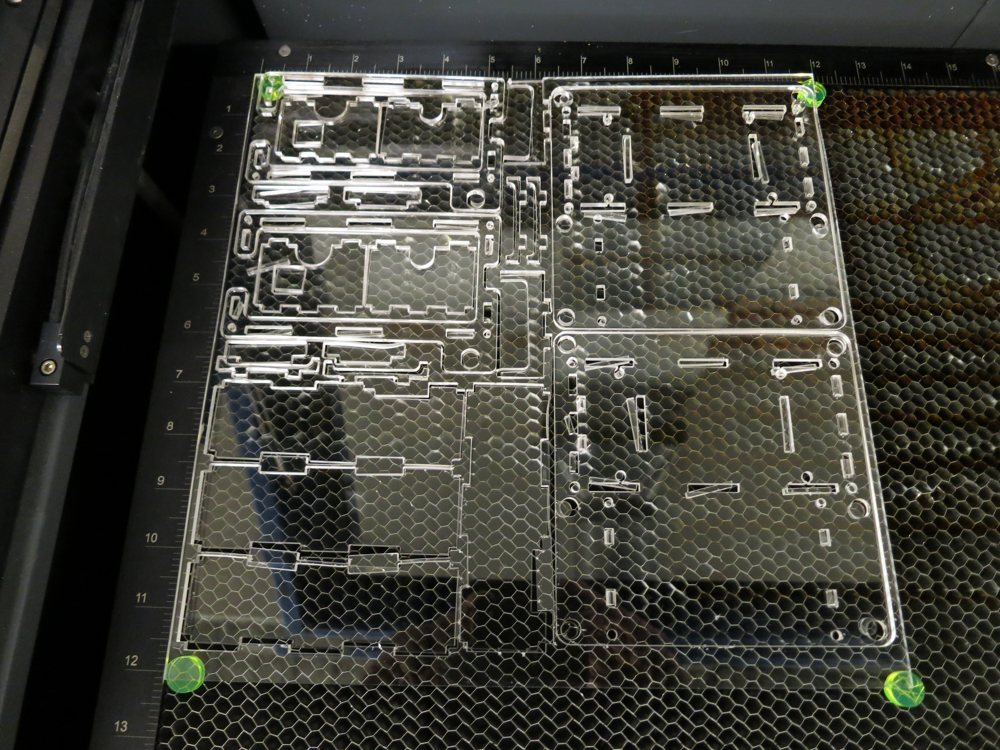
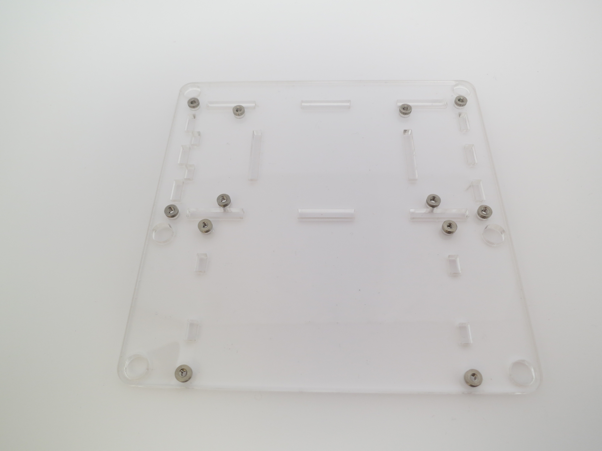
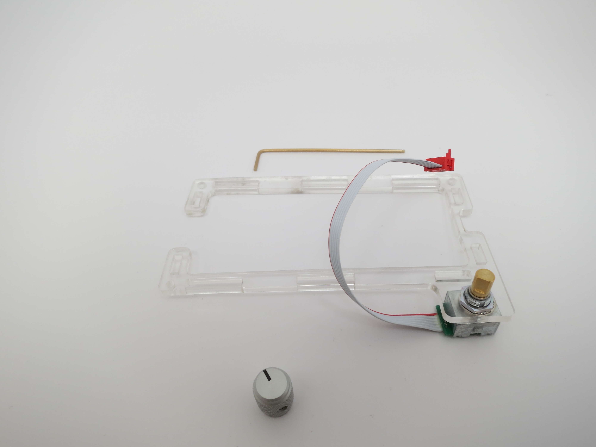

#modular_device_enclosure

Authors:

    Peter Polidoro <polidorop@janelia.hhmi.org>

License:

    BSD

##Assembly Instructions

[BOM](../bom/bom.csv)

[Additional Parts and Tools Needed](../bom/bom_pcb_add.csv)

* Use this dxf file: ../dxf/laser_cutter_0.125in_display.dxf for cutting out acrylic parts on the laser cutter.

* The 12"x12"x1/8" acrylic sheet yields enough parts for two enclosures.

* Each enclosure has 11 acrylic parts.

* Use the hand press

* Press the 8 4-40 captive nuts into the larger 8 holes of the enclosure bottom. Note proper side up.

* Use the hand press again

* Press the 4 2-56 captive nuts into the smaller 4 holes of the enclosure bottom.

* Use a crescent wrench to attach encoder to enclosure top.

* Use 1/16in allen wrench

* To attach knob onto encoder. Make sure knob is not so low that it cannot be pressed down to make the encoder button click.

