#modular_device_enclosure

Authors:

    Peter Polidoro <polidorop@janelia.hhmi.org>

License:

    BSD

##Assembly Instructions

[BOM](../bom/bom.csv)

[Additional Parts and Tools Needed](../bom/bom_pcb_add.csv)

* Use this dxf file: [../dxf/laser_cutter_0.125in_display.dxf](../dxf)
  for cutting out acrylic parts on the laser cutter.

* The 12"x12"x1/8" acrylic sheet yields enough parts for two
  enclosures.

* Each enclosure has 11 acrylic parts.

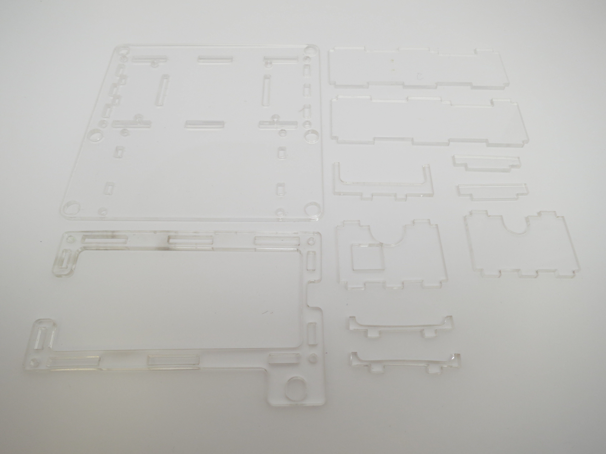

* Use the hand press

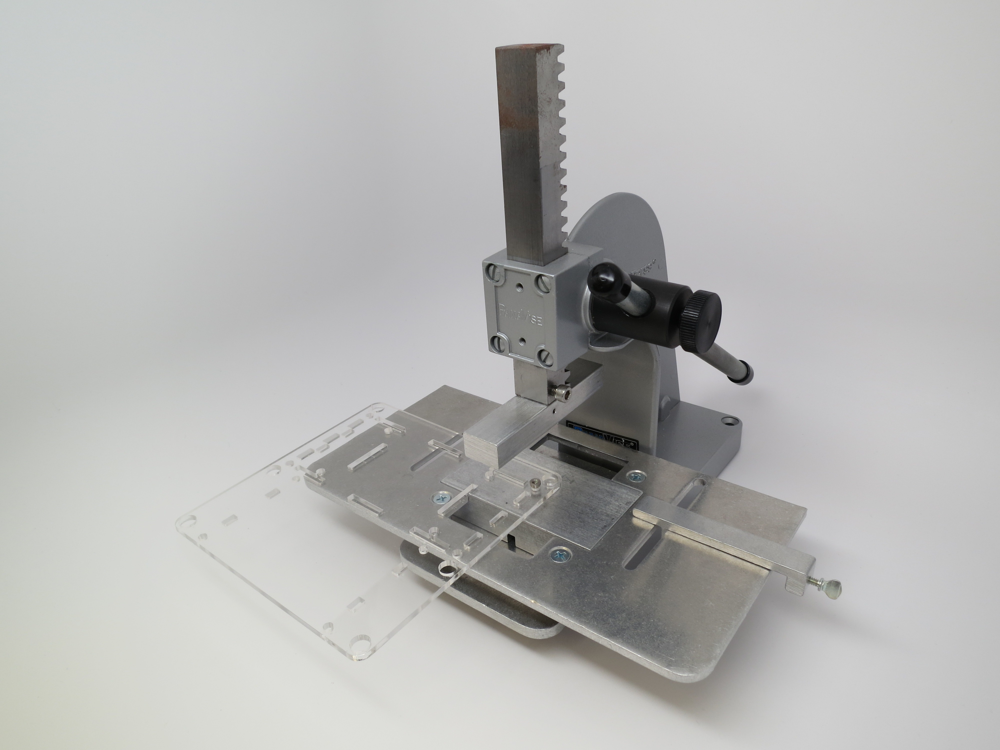

* Press the 8 4-40 captive nuts into the larger 8 holes of the
  enclosure bottom. Note proper side up.

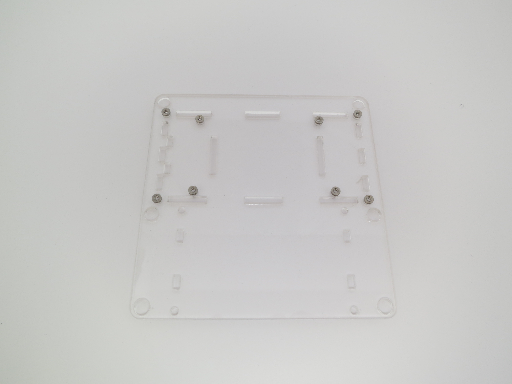

* Use the hand press again

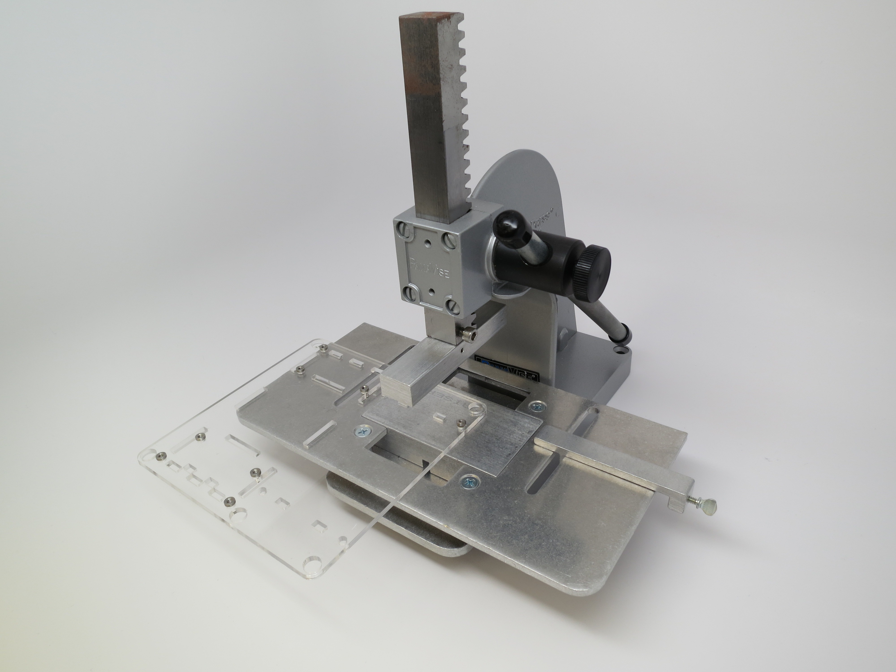

* Press the 4 2-56 captive nuts into the smaller 4 holes of the
  enclosure bottom.

* Use a crescent wrench to attach encoder to enclosure top.

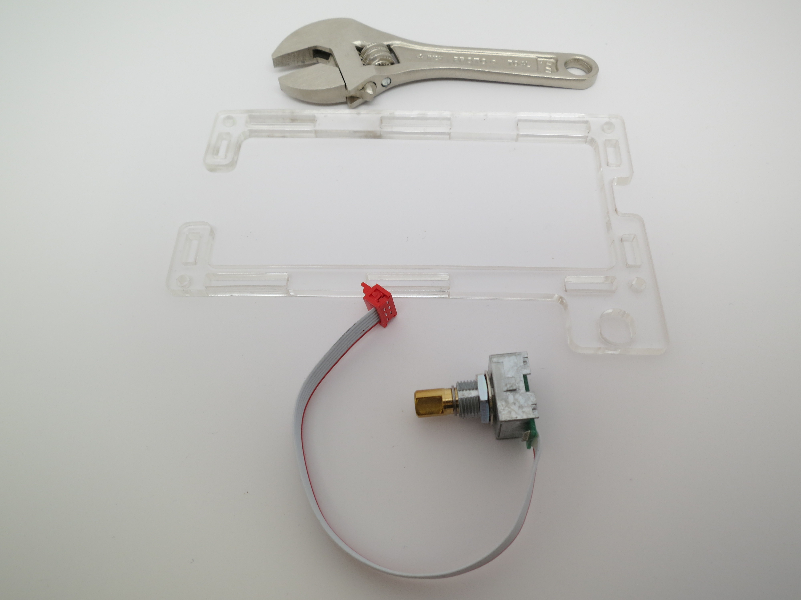

* Use 1/16in allen wrench

* To attach knob onto encoder. Make sure knob is not so low that it
  cannot be pressed down to make the encoder button click.

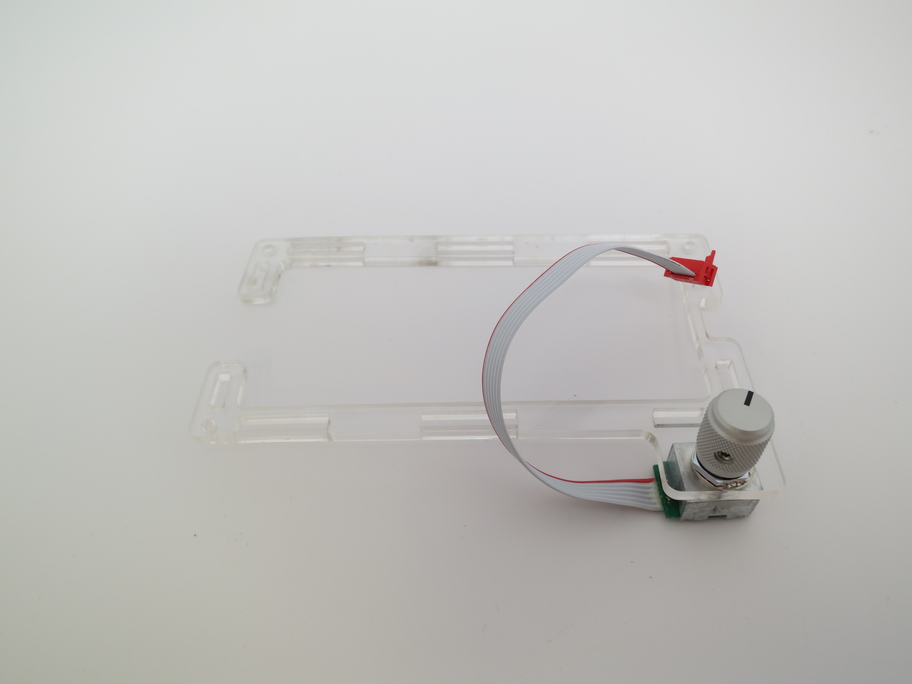

* Attach whichever modular device pcb you want to the Arduino Mega
  2560.

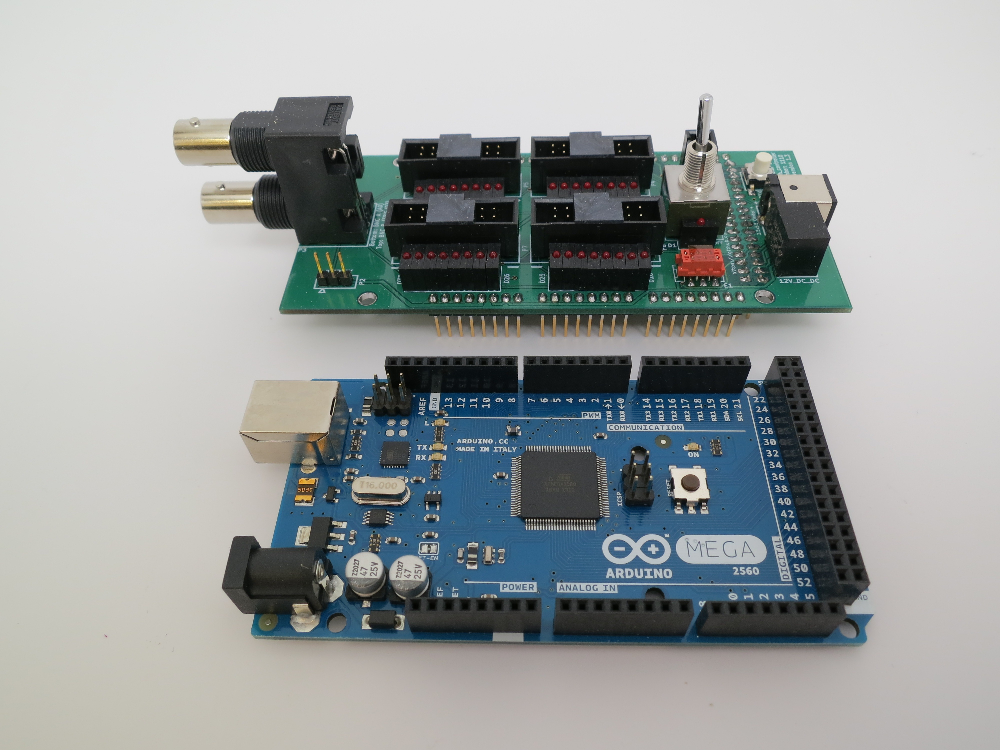

* Make sure the pins are pushed all the way down into the sockets.

* Place the 3 pcb spacers

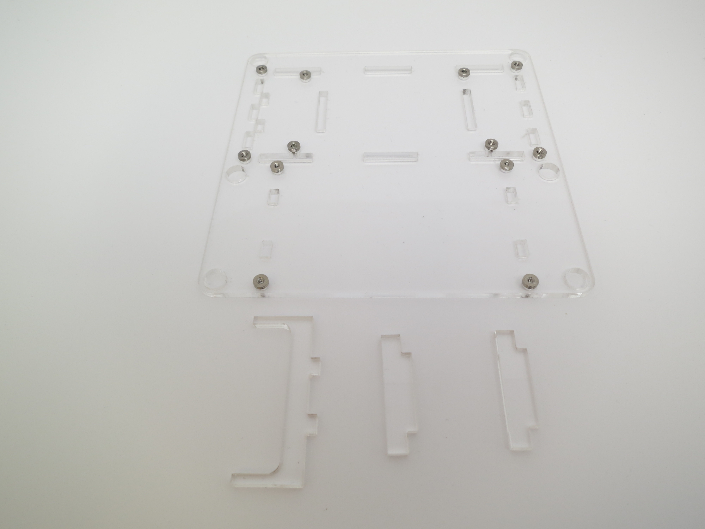

* into the enclosure bottom

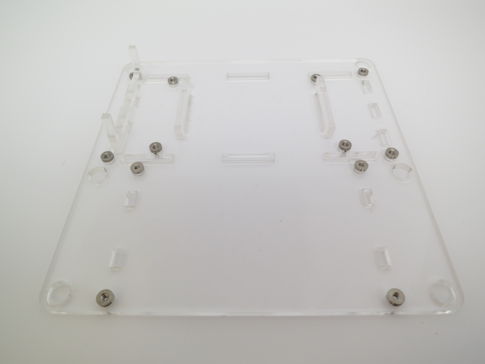

* Attach the pcbs to the enclosure bottom using the 4 1in 4-40 screws
  and the 4 plastic washers using a 3/32in allen wrench.

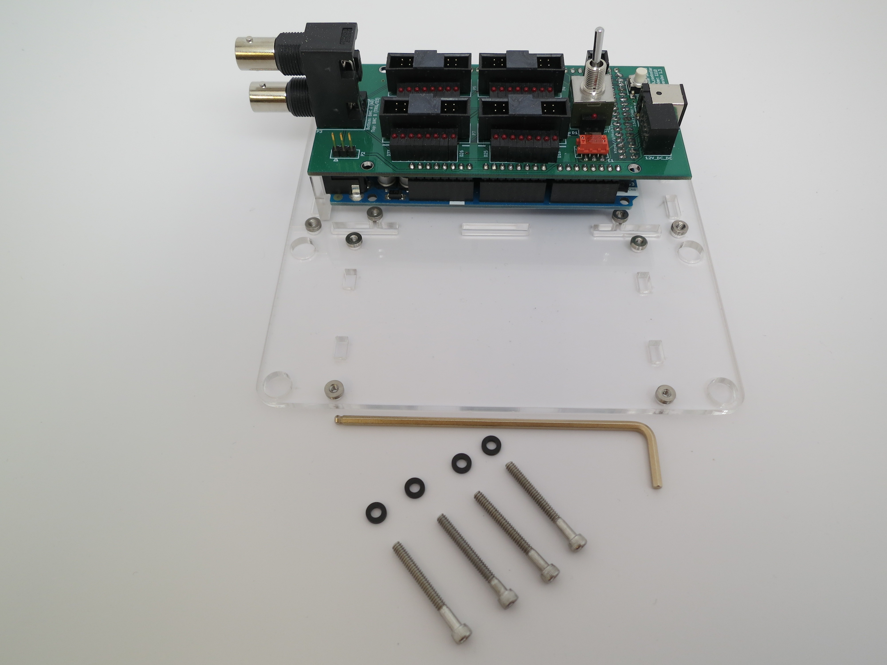

* Place the 4 enclosure sides

* into the enclosure bottom

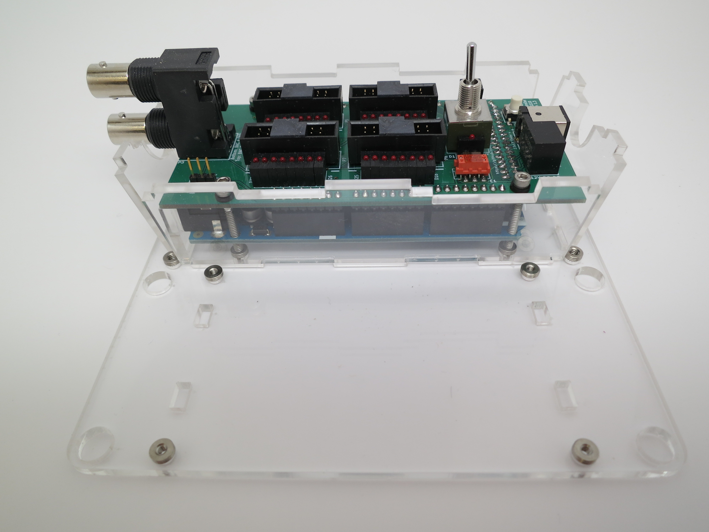

* Solder the 01x03 header

* into the display

* Attach encoder cable to pcb and shape the encoder wires to the
  enclosure.

* Place display spacers into enclosure bottom. Note that the encoder
  wires run underneath the display spacer.

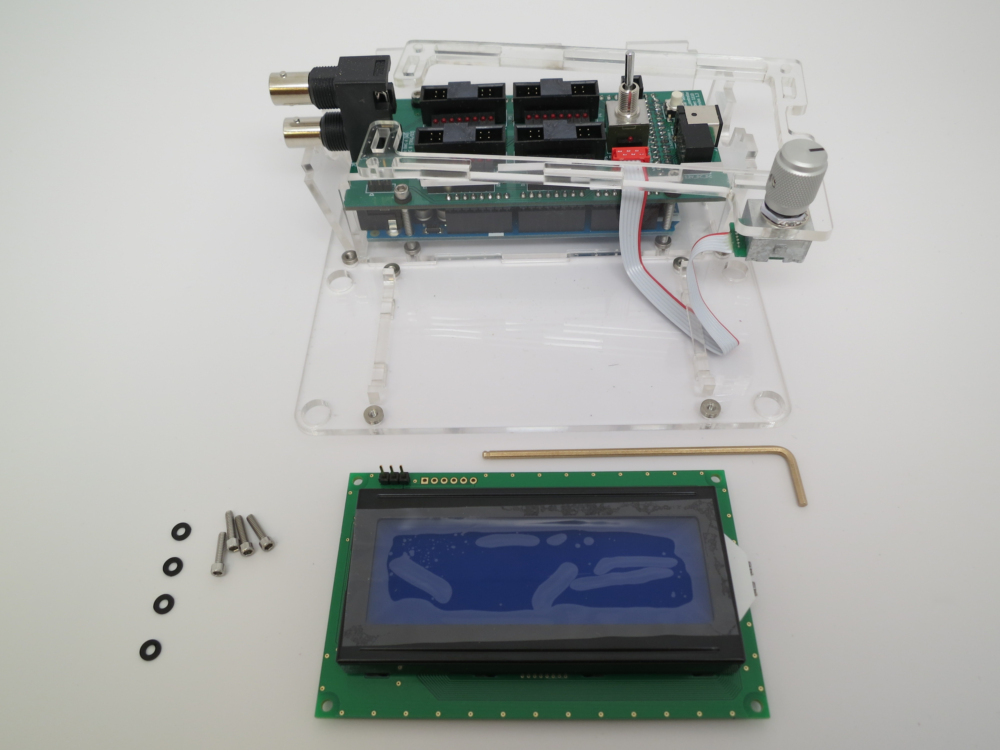

* Use the 4 2-56 screws and the 4 plastic washers to attach the
  display to the enclosure bottom using a 5/64in allen wrench.

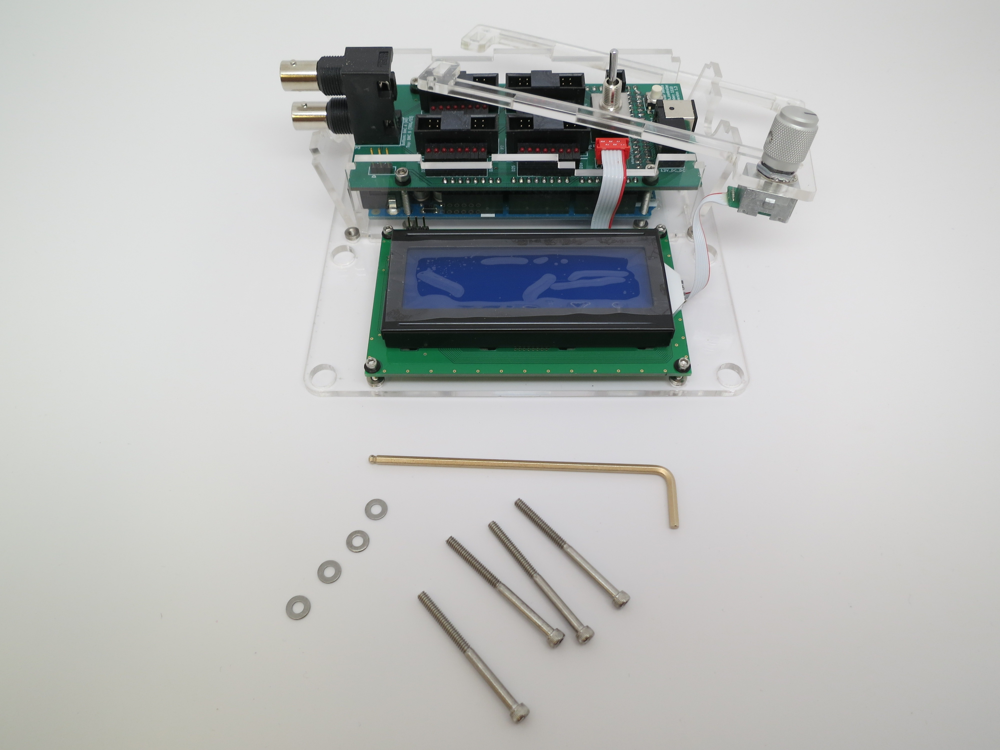

* Attach the enclosure top using the 4 1-1/2in 4-40 screws and the 4
  metal washers using a 3/32in allen wrench.

* Use the 3-pin 4in cable to connect the display to the pcb.

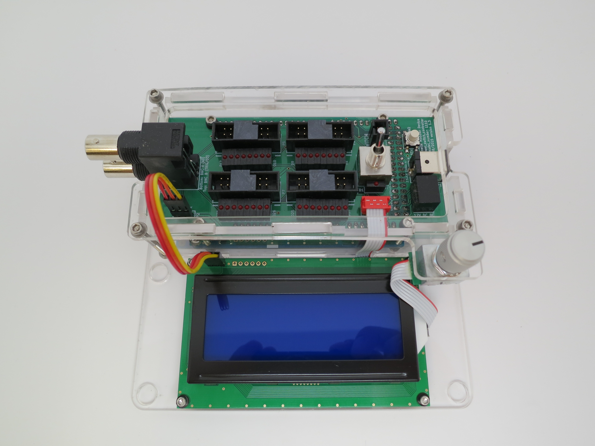

